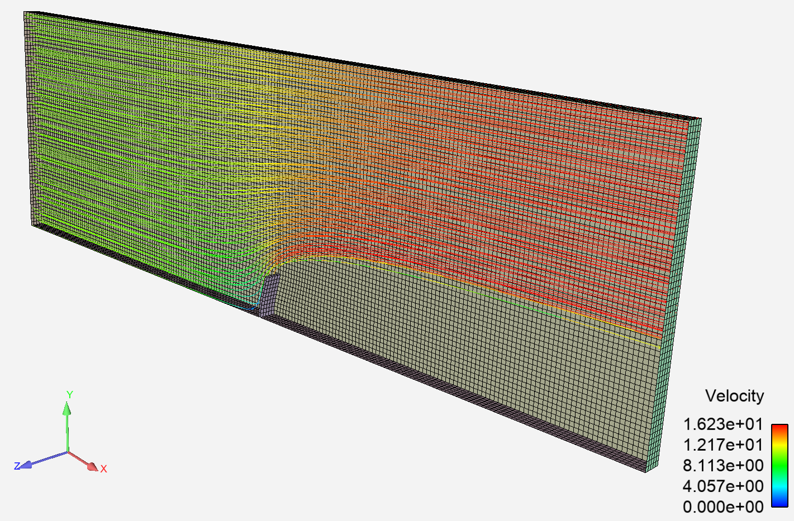

# Overview

This case couples Fluent to MAPDL to perform
a steady FSI analysis using System Coupling.

# Instrutions

- Install pyFluent

`pip install ansys.fluent.core`

- Install pyMapdl

`pip install ansys.mapdl.core`

- Install pySystemCoupling

`pip install ansys.systemcoupling.core`

- Run script

`python run.py`
