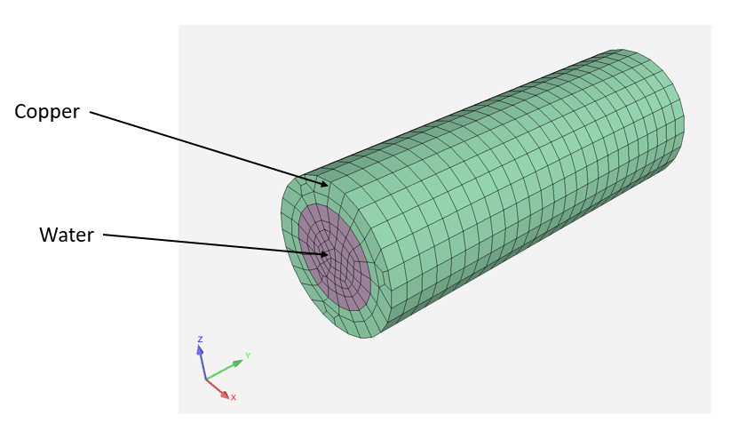

# Overview

This case couples two Fluent instances to perform
a CHT analysis using System Coupling.



The purpose of this example is to demonstrate the integration
of pyFluent and pySystemCoupling.

The starting point for this example is SpaceClaim geometry files.
The Python script will generate the mesh and set up the Fluent problem and have
System Coupling solve the coupled analysis.

# Instrutions

- This example requires PyFluent codegen for now. Eventually, all that will be
  required is `pip install ansys.fluent.core`.

```
git clone https://github.com/ansys/pyfluent.git
cd pyfluent
pip install pip -U
pip install -e .
python codegen/allapigen.py  # Generates the API files
```

- Install pySystemCoupling

`pip install ansys.systemcoupling.core`

- Run script

`python run.py`
