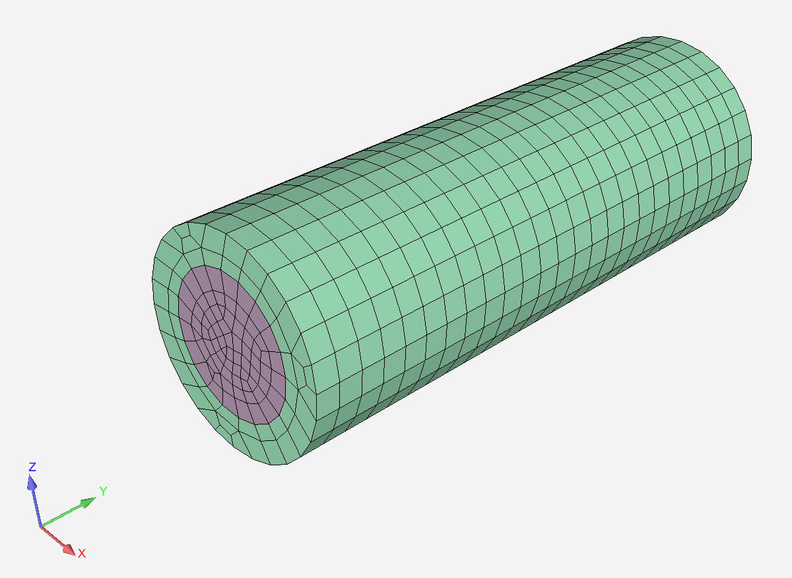

# Overview

This case couples two Fluent instances to perform
a CHT analysis using System Coupling.

The purpose of this example is to demonstrate the integration
of pyFluent and pySystemCoupling.

The starting point for this example is Fluent mesh files.
The Python script will set up the Fluent problem and have
System Coupling solve the coupled analysis.

# Instructions

- Install pyFluent

`pip install ansys.fluent.core`

- Install pySystemCoupling

`pip install ansys.systemcoupling.core`

- Run script

`python run.py`
