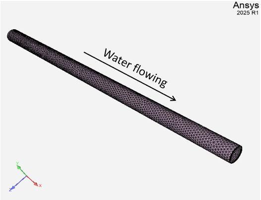
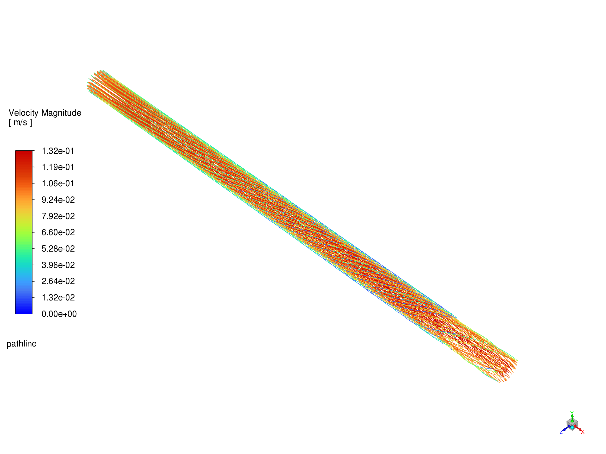

# Overview

This case does a 1-way coupling from a custom script that provides
a cloud of points and force values to Fluent.

Fluent setup is a simple pipe with water flowing through it:

The source point cloud and solution data is generated within the Python script. The point
cloud overlaps the fluid domain, and forces are calculated to make
the fluid swirl in a counter-clock-wise direction (if looking from inlet
to an outlet).

In the end, the pathline.png file is produced that shows the streamlines.

# Instrutions

This case requires v242 System Coupling and Fluent (v241 Fluent might be ok).

- Ansys Python (in v242/commonfiles/CPython) must be used at least for participant.py script

- Install PyFluent, and PySystemCoupling

`pip install ansys.fluent.core ansys.systemcoupling.core`

- Install SCP library .whl file (you'll need to contact me to get it for now)

`pip install ansys_systemcoupling_partlib-24.2.0-cp310-abi3-win_amd64.whl`

- Run script

`python run.py`
